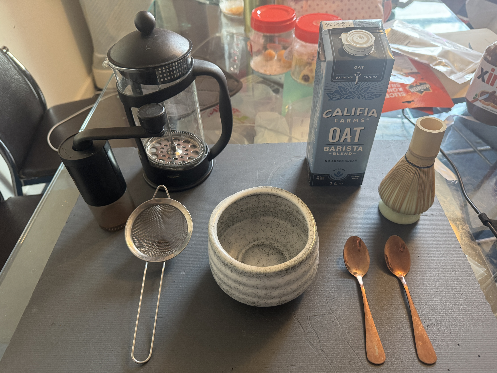
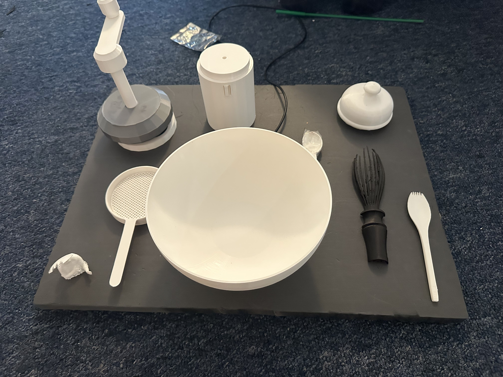

# ID-26-TeamA-Spork

[Overleaf link](https://www.overleaf.com/8275173374gyxfmgztxgqn#82d2b0")

## Team Member
| Name           | Student ID | Role |
|----------------|------------|------|
| Ameera Nur     | ct23065    |  Hardware (Data Analysis), Software (Bridge between software and hardware), Project Manager    |  
| Clarissa Ch'ng | fr22378    |  Software (App design, frontend), Hardware (Wiring and 3D Printing & Design), Project Manager    |
| Dennis Han     | jf23616    |  Research, Writing, User Study, Hardware (Creating initial 3D prints)    |
| Gerard Chaba   | tl23383    |  Research, Writing, User Study, Software (Creating initial gameplay links)    |
| Zakiya Yousuf  | hg23195    |  Research Lead, Writing, User Study    |

## Project Description
<!-- Our project is a motion-based interactive device that combines physical tea and coffee-making tools (such as a sieve, matcha whisk, and kettle) embedded with magnets and sensors to track player movements, which are then translated into a calming, <i>Cooking Mama</i> or <i>Just Dance</i> style video game. Players follow on-screen tutorials and progress through three levels of increasing difficulty, replicating sequences of motions to accurately fill a virtual cup, with a final creative level allowing them to record and repeat their own sequence. Designed to be both satisfying and therapeutic, the game aims to assist individuals in regaining specific motor skills while offering a relaxing, <i>A Little to the Left</i> style experience for casual home enjoyment. -->
A "tea set" proxy to explore and understand daily rituals and habits, particularly understanding how a ritual is formed based on preconcepted understanding of objects (affordances of tea making tools), how it could be disrupted by asking a user to use a tool in an unconventional way/sequence, and how users feel about it. Research can look into how children play with objects in a nonsensical way, and how it might be harder for adults to be creative with how they use an object. 

To bridge the physical and digital realms, a custom web application—built with TypeScript for multi-device compatibility—animates this research. Acting as a 'game master,' the software transforms the tea set into an interactive platform by introducing rule-based constraints that disrupt habitual behaviour. 

#### Keywords
Rituals, Habit formation, Proxy objects, Breaking, mindfulness with proxy objects, daily rituals

## 2-3 related projects​
[Related Work Doc (Draft)](https://docs.google.com/document/d/1Le0JpHag-Y8FguWCS-6rs0WAU3aVcPPl2qvLAIEhsyM/edit?usp=sharing)

[Gameplay Idea (Youtube)](https://www.youtube.com/watch?v=IAE1A2zHqT4)

## Target Demographic
- Casual coffee/tea drinks who would want to appreciate/ learning other rituals/ ways of making coffee.
- General gamers looking for <i>Cozy/Satisfying</i> experiences like A Little to the Left.
- [Target User Doc (Draft)](https://uob-my.sharepoint.com/:w:/g/personal/tl23383_bristol_ac_uk/IQAO5trw0ovZRb4hTxvCW57CAaJbiCogQJgktmuvp1reydY?e=JohoBU)

## Technologies Used 
- TypeScript + Vite (frontend)
- Web Serial API (Arduino communication)
- Python (backend motion analysis/feature extraction)
- Arduino (magnetometer sensor)

## Annotation of context​
[Understanding Target Users (Viewable Only)](https://forms.cloud.microsoft/e/svqNKZq410)

[Understanding Target Users (Editable)](https://forms.cloud.microsoft/Pages/DesignPageV2.aspx?subpage=design&FormId=MH_ksn3NTkql2rGM8aQVG1poaN2JOopGnBl2xFvLbGNUQldPNjBGTkpUMkpXTDRZMDFJSlg4OVdMSy4u)

[Main Interactive Devices Hub Link (Google Sheet)](https://docs.google.com/spreadsheets/d/1WJlrQEFoqLSk08SffmYSsfnndG825bTncRuUyI96l8E/edit?gid=0#gid=0)

| Picture | Description |
| :--- | :--- |
|  | **Sticky Notes**: To identify what components do we need for the board |
|  | **Real Objects**: To visualise how the board would look like -- next step would be 3d printing the things out |
|  | **3D Objects**: testing out the size of the objects with the 3d objects, looking for components placement, adjusting the posisiton of mr spork (our nfc reader) and buttons on the board |
|  | **First iteration for software**: First idea dump for the game|
|  | **Second iteration for software**: Refined the main page to reflect more like the actual board placement -- more visuals imported|
|  | **Tutorial page screens**: Shows how the tutorial flow evolved — e.g. the grinder/pour/whisk components, motion feedback, success counter|
|  | **Gameplay screens**: Shows the level progression, motion detection during play, choreograph/replay mode|

### To Do 
| Date | To-do |
| :--- | :--- |
| 12/03 | [ ] Solder   [ ] Magnet placements   [ ] NFC Capsule placement   [ ] Recording motions   [ ] Tutorial screens adjustment (Visuals)   [ ] Gameplay logic  [ ] z-axis feedback to real time scrolling graph   [ ] Button function (fallback keypress)   |

### Notes
Week 20 
- tested with joystick but it's too heavy and laggy for our game 
- tries different types of 3d matcha whisk but it fails -- hence using the normal balloon whisk 
- motion detection work successfully 
- storyboarded our gameplay 
